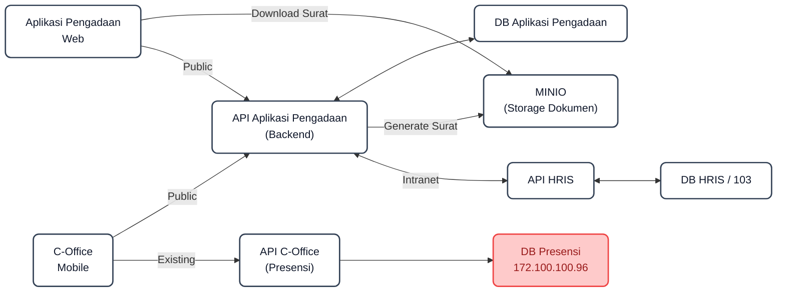

# SIPRO (Sistem Informasi Pengadaan KCI)

<div align="center">


**Aplikasi Terintegrasi Manajemen & Digitalisasi Proses Pengadaan Barang/Jasa PT Kereta Commuter Indonesia**

</div>

---

## 📌 Tentang Aplikasi

**SIPRO** (*Sistem Informasi Pengadaan*) adalah platform web enterprise yang dirancang khusus untuk mengelola, mendokumentasikan, dan memantau seluruh siklus hidup pengadaan barang dan jasa di lingkungan **PT Kereta Commuter Indonesia (KCI)** secara transparan, akuntabel, dan real-time.

Aplikasi ini mencakup seluruh rantai proses pengadaan: mulai dari perencanaan (RUP), verifikasi dokumen, penerbitan dokumen tahapan (NPP, SP3, Kontrak), proses pengujian & BAST, manajemen rekanan/vendor, standarisasi harga satuan, hingga verifikasi pembayaran.

---

## ✨ Fitur Utama

### 1. 📋 Manajemen RUP (Rencana Umum Pengadaan)
- Pembuatan dan pengajuan paket RUP tahunan per unit kerja.
- Manajemen pagu anggaran, sumber dana, dan metode pengadaan.
- Alur persetujuan (*approval workflow*) terstruktur.

### 2. 📑 Alur Dokumen Pengadaan & Tahapan
- Tracking tahapan pengadaan digital secara berurutan:
  - **NPP** (Nota Permintaan Pengadaan)
  - **SP3** (Surat Penunjukan Pelaksanaan Pengadaan)
  - **Draft & Finalisasi Kontrak**
  - **Uji Fungsi & Berita Acara Serah Terima (BAST)**
- Upload dan preview berkas lampiran pendukung (TOR, RAB, Dokumen Penawaran).

### 3. 🛡️ Modul Verifikasi Terintegrasi
- Verifikasi RUP oleh tim verifikator/perencana.
- Verifikasi tahapan pengadaan & kelengkapan dokumen legalitas.
- Verifikasi pengajuan termin pembayaran vendor.

### 4. 🧪 Modul Pengujian & BAST
- Pencatatan hasil pengujian barang/jasa (Uji Visual, Uji Fungsi, Uji Operasi).
- Penerbitan Berita Acara Hasil Pengujian & BAST secara digital.

### 5. 👥 Manajemen Vendor & Rekanan
- Database rekanan/penyedia barang & jasa terverifikasi.
- Riwayat performa dan riwayat kontrak pengadaan vendor.

### 6. 💰 Database Standar Harga Satuan
- Katalog acuan harga satuan barang dan jasa KCI.
- Pencarian dan filter harga untuk memudahkan penyusunan HPS & RAB.

### 7. 💳 Monitoring & Verifikasi Pembayaran
- Pengajuan tagihan/termin pembayaran oleh unit/vendor.
- Rekapitulasi progres pembayaran dan status pencairan anggaran.

### 8. 🔒 Role-Based Access Control (RBAC) & Keamanan
- Pembagian peran pengguna yang fleksibel (*Admin, Verifikator, User Unit Kerja, Vendor*).
- Autentikasi token aman dengan **Laravel Sanctum**.

---

## 🏗️ Arsitektur Sistem



---

## 💻 Tech Stack

### Frontend
- **Framework**: React 18 + Vite
- **Language**: TypeScript
- **UI Components & Styling**: Tailwind CSS, Radix UI, Lucide Icons, Emotion/MUI
- **Data Visualization**: Recharts
- **State & HTTP**: React Hooks, Axios

### Backend
- **Framework**: Laravel (PHP 8.2+)
- **Authentication**: Laravel Sanctum (Bearer Token)
- **Database ORM**: Eloquent ORM
- **API Standard**: RESTful JSON API

### Database & Storage
- **Database**: MySQL 8.0+ / MariaDB (XAMPP Compatible)
- **File Storage**: Local Filesystem / MinIO S3 Object Storage

---

## 🚀 Panduan Instalasi & Menjalankan Aplikasi

### 1. Prasyarat Sistem
Pastikan perangkat Anda telah terpasang:
- **PHP** >= 8.2 (disarankan via XAMPP)
- **Composer** >= 2.x
- **Node.js** >= 18.x & **npm**
- **MySQL / MariaDB**

---

### 2. Konfigurasi Backend (`pengadaan-kci`)

```bash
# 1. Masuk ke folder backend
cd pengadaan-kci

# 2. Install dependensi PHP
composer install

# 3. Salin environment file & generate key
cp .env.example .env
php artisan key:generate

# 4. Konfigurasi database di file .env
# DB_DATABASE=pengadaan_kci
# DB_USERNAME=root
# DB_PASSWORD=

# 5. Jalankan migrasi dan seeder data awal
php artisan migrate --seed

# 6. Jalankan backend API server (port 8000)
php artisan serve --port=8000
```

---

### 3. Konfigurasi Frontend (`final_project`)

```bash
# 1. Masuk ke folder frontend
cd final_project

# 2. Install dependensi Node.js
npm install

# 3. Jalankan development server (port 5173)
npm run dev
```

---

### 4. ⚡ Cara Cepat (One-Click Runner untuk Windows)

Jika menggunakan Windows dan XAMPP, Anda dapat langsung menjalankan file batch otomatis:
```cmd
double-click start-sipro.bat
```
Skrip ini akan otomatis menyalakan MySQL, Laravel Backend API (`http://localhost:8000`), dan React Frontend (`http://localhost:5173`).

---

## 🔑 Akun Demo / Default Credentials

| Peran (Role) | Email / Username | Password | Deskripsi Akses |
| :--- | :--- | :--- | :--- |
| **Super Admin** | `admin@sipro.com` | `admin123` | Akses penuh seluruh sistem, user management & verifikasi |
| **IT User / Unit** | `it@sipro.com` | `it123` | Pembuatan RUP, pengajuan pengadaan, upload dokumen |

---

## 📁 Struktur Direktori Proyek

```text
KCI-PROJEKAN/
├── final_project/             # React + Vite Frontend Application
│   ├── src/
│   │   ├── components/        # Komponen UI (Admin, Pengadaan, Verifikasi, dsb)
│   │   ├── pages/             # Halaman View Aplikasi
│   │   ├── services/          # HTTP API Client (Axios)
│   │   └── store/             # Global State Management
│   └── package.json
│
├── pengadaan-kci/             # Laravel Backend REST API
│   ├── app/
│   │   ├── Http/Controllers/  # Controller API (RUP, Pengadaan, User, dsb)
│   │   └── Models/            # Eloquent Database Models
│   ├── database/
│   │   ├── migrations/        # Database Schema Migrations
│   │   └── seeders/           # Database Dummy & Default Seeds
│   ├── routes/api.php         # Endpoint Definisi REST API
│   └── composer.json
│
├── start-sipro.bat            # Windows One-Click Auto Runner
└── README.md                  # Dokumentasi Utama Proyek
```

---

## 📄 Lisensi & Hak Cipta

Dokumentasi dan source code sistem ini dikembangkan untuk kebutuhan internal **PT Kereta Commuter Indonesia (KCI)**. Seluruh hak cipta dilindungi.
